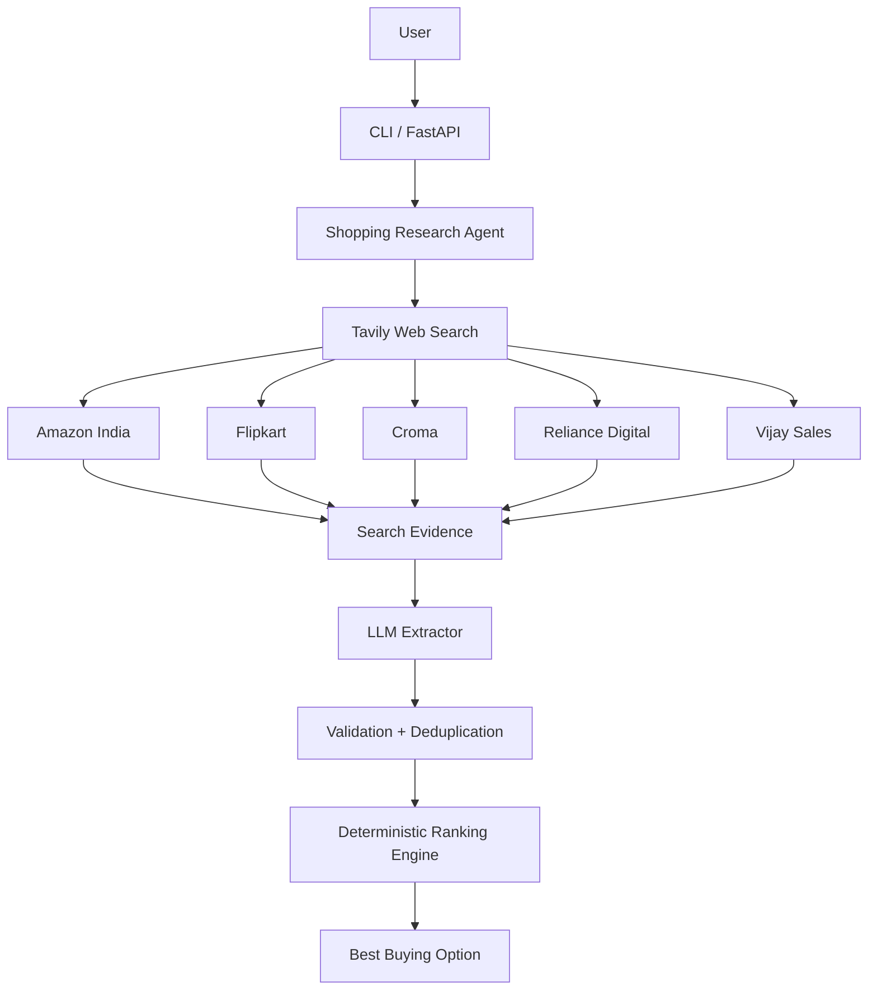

# Developer Implementation & Technical Documentation

## 1. Executive Summary
The AI Shopping Research Agent is a Python application that accepts a natural-language product request, searches multiple e-commerce platforms on the live web, extracts structured product and pricing information with an LLM, validates the results, compares effective prices, and recommends the best buying option.
The core engineering principle is to use AI for semantic understanding and extraction while keeping numerical comparison and final ranking deterministic. This reduces hallucination risk and makes the recommendation explainable and testable.

## 2. Objective
Build an AI-powered shopping research agent that can answer a request such as:
`iPhone 16 Pro 256GB India`
The system should find current offers across multiple e-commerce platforms and recommend the best option with evidence links.

## 3. Scope
* Accept free-form product names from CLI or REST API.
* Search Amazon India, Flipkart, Croma, Reliance Digital, and Vijay Sales.
* Use live web search rather than hard-coded prices.
* Extract product title, price, shipping, availability, match confidence, and source URL.
* Normalize offers and remove duplicate URLs.
* Rank valid offers using a deterministic Python scoring function.
* Return a recommendation with reason, confidence, and evidence URL.
* Handle individual search/extraction failures without terminating the complete research job.

## 4. Technology Stack
| Layer | Technology | Purpose |
|---|---|---|
| Language | Python 3.11+ | Core implementation |
| API | FastAPI | REST endpoint and Swagger UI |
| Web search | Tavily | Live web research |
| AI | OpenAI Responses API | Product/price extraction |
| Validation | Pydantic | Typed data models |
| Testing | Pytest | Unit tests |
| Configuration | python-dotenv | Environment variables |

## 5. System Architecture

## 6. End-to-End Workflow

### 6.1 Search Query Generation
A merchant-specific site query is generated for each configured platform (e.g., `site:amazon.in "iPhone 16 Pro 256GB India" price`).

### 6.2 AI Extraction
The LLM converts unstructured evidence into a `ProductOffer` object, enforcing rules against hallucinating prices.

### 6.3 Validation and Ranking
Python calculates `effective_price = item_price + shipping` and deduplicates URLs.
The ranking is scored deterministically based on price, match score, and evidence score.

## 7. Key Engineering Decisions
* **AI is used where it adds value**: For semantic matching and extracting structured facts from messy text.
* **Numerical decisions remain deterministic**: Price comparison is arithmetic and doesn't rely on the LLM reasoning.
* **Evidence is preserved**: URLs are maintained for transparency.
* **Failure isolation**: One failing platform does not block the others.

## 8. Production Upgrade Path
* Caching results
* Persistent history (PostgreSQL)
* Background Workers (Redis)
* Advanced Agentic Loop (Explicit tool calling with verification)
